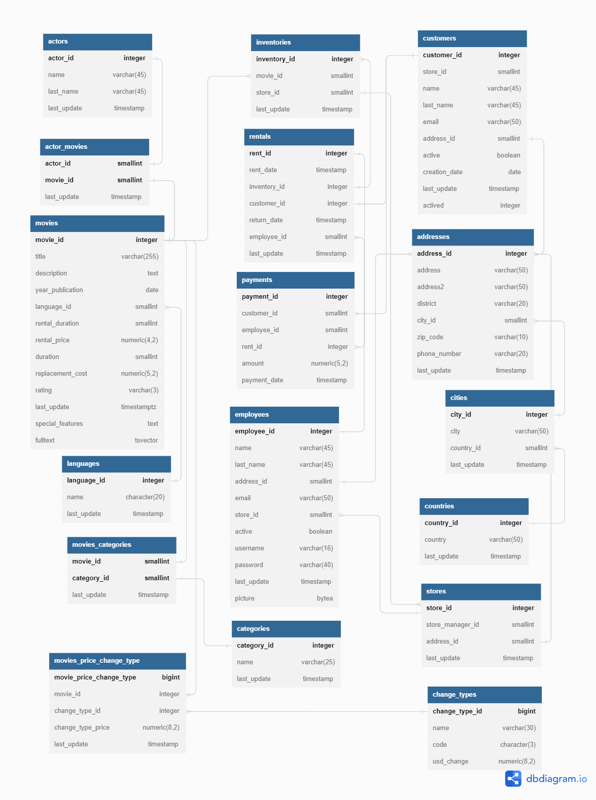
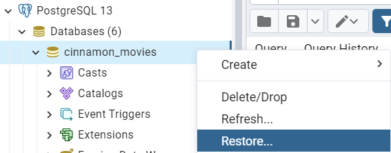

# CINNAMON_MOVIES
This is a database with information from a dummy movie rental company. It contains information about price of each movie, categories, orders, customers, languages, stores and payments. Also the database is able to make queries like top 10, rentals per year and month, bla using stored procedures, triggers and window functions for performance efficiency.

## ER Diagram


## **⚡️ Quickstart.**
You can import the DB information in two different ways:

### ShellScript:
Using `psql` command from terminal with file [restore.sql](backup/restore.sql):
    
```bash
    psql -U username -W -h cinnamon_movies < restore.sql
```
Where the params are:
- U: Refers to the User, in this case it can be the database owner user or the postgres user.
- W: Password of the user specified above (if any).
- h: PostgreSQL server to which we will connect to get our dump.

### PgAdmin: 
From the PgAdmin UI import the file [restore.tar](backup/restore.tar):
    

    


## Queries:

### Top 10:
We use the window function `ROW_NUMBER()` to assign the place to each movie with the highest number of rentals.
```sql
SELECT
    movies.movie_id AS id,
    movies.title,
    COUNT(*) AS rent_amount,
    ROW_NUMBER() OVER(
        ORDER BY COUNT(*) DESC
    ) AS spot
FROM rentals
    INNER JOIN inventories ON rentals.inventory_id=inventories.inventory_id
    INNER JOIN movies ON inventories.movie_id=movies.movie_id
GROUP BY movies.movie_id
ORDER BY rent_amount DESC
LIMIT 10;
```
|id |title                        |rent_number|spot                                         |
|---|-----------------------------|-----------|---------------------------------------------|
|103|Bucket Brotherhood           |34         |1                                            |
|738|Rocketeer Mother             |33         |2                                            |
|382|Grit Clockwork               |32         |3                                            |
|331|Forward Temple               |32         |4                                            |
|730|Ridgemont Submarine          |32         |5                                            |
|...|...               |...         |...                                            |

### Price update:
1. We create a trigger function which will update the data in the movies_price_change_type table each time new information is inserted in the movies table.


2. Next, we insert the next script in the code tab:
```sql
BEGIN
	INSERT INTO movies_price_change_type(
        movie_id,
        change_type_id,
        change_type_price,
        last_update )
	SELECT NEW.movie_id,
		change_types.change_type_id,
		change_types.usd_change * NEW.rental_price AS change_type_price,
		CURRENT_TIMESTAMP
	FROM change_types
	WHERE change_types.code = 'MXN';
	RETURN NEW;
END
```
3. Finally we create the trigger that will call the function each time data is inserted or modified in the movies table.
```sql
CREATE TRIGGER trigger_update_change_types
    AFTER INSERT OR UPDATE
    ON public.movies
    FOR EACH ROW
    EXECUTE PROCEDURE public.movie_price_change_type();
```

### Amount of rentals per city:
We use mulptiple `INNER JOIN` to create the connection between the cities, stores, inventory and movies tables through the foreign keys.
```sql
SELECT cities.city_id,
    cities.city,
    COUNT(*) AS rents_by_city
FROM cities
    INNER JOIN addresses ON cities.city_id=addresses.city_id
    INNER JOIN stores ON stores.address_id=addresses.address_id
    INNER JOIN inventories ON inventories.store_id=stores.store_id
    INNER JOIN rentals ON inventories.inventory_id=rentals.inventory_id
GROUP BY cities.city_id;
```
|city_id|city                         |rents_by_city|
|-------|-----------------------------|-------------|
|446    |Salinas                      |1647         |
|335    |Mexicali                     |3100         |
|573    |Warren                       |3528         |
|323    |Mandaluyong                  |1486         |

### Number of rentals for each movie per month and year:
We use the `DATE_PART()` function to extract the year and month in two different columns.
```sql
SELECT 
    DATE_PART('year',rentals.rent_date) AS year,
    DATE_PART('month',rentals.rent_date) AS month,
    movies.title,
    COUNT(*) AS rentals_amount
FROM rentals
    INNER JOIN inventories ON rentals.inventory_id=inventories.inventory_id
    INNER JOIN movies ON inventories.movie_id=movies.movie_id
GROUP BY
    year,
    month,
    movies.movie_id
ORDER BY rentals_amount DESC;
```
|year|month                    |title |rentals_amount|
|--------|-----------------------------|------|--------------|
|2005    |7                            |Scalawag Duck|16            |
|2005    |7                            |Primary Glass|15            |
|2005    |7                            |Greatest North|15            |
|2005    |7                            |Shock Cabin|14            |
|2005    |7                            |Butterfly Chocolat|14            |
|...    |...                            |...|...           |

### Working with JSON data:
The orders table stores non-movie related rental information as JSON objects.
- Adding information:
```sql
INSERT INTO orders(info) VALUES(
    '{"client":"David Sanchez",
    "items":{
        "product":"Bottle","amount":"24"}
    }',
    '{"client":"Edna Cardenas",
    "items":{
        "product":"Toy car","amount":"1"}
    }')
```
- Extracting data in string format:
```sql
SELECT
    info ->> 'client' AS client
FROM orders
WHERE info -> 'items' ->> 'product'='Bottle';    
```